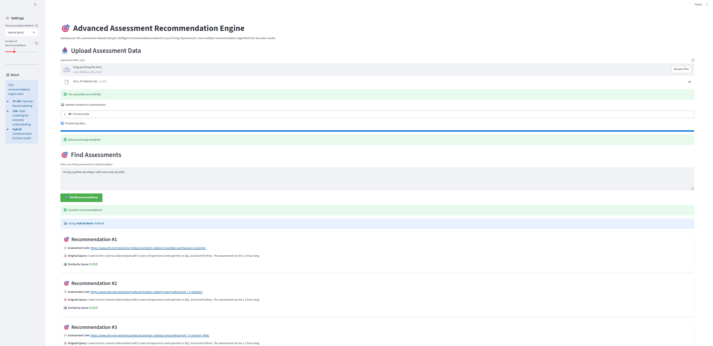

# 🎯 Advanced Assessment Recommendation Engine

A powerful Streamlit-based recommendation engine that matches job requirements with SHL assessments using multiple AI algorithms.



## 🚀 Features

- **Multiple Recommendation Algorithms**: TF-IDF, LDA Topic Modeling, and Hybrid approach
- **Excel Data Upload**: Easy upload of assessment datasets
- **Intelligent Matching**: Semantic understanding of job requirements
- **Beautiful UI**: Professional interface with custom styling
- **Configurable Settings**: Adjust recommendation count and algorithm choice
- **Real-time Processing**: Progress tracking and instant results

## 📋 Requirements

- Python 3.7+
- Streamlit
- Pandas
- Scikit-learn
- OpenPyXL
- NumPy

## 🛠️ Installation

1. Clone this repository or download the files
2. Install dependencies:

```bash
pip install streamlit pandas scikit-learn openpyxl numpy
```

## 📂 File Structure

```
.
├── app.py                  # Main application
├── requirements.txt        # Dependencies
├── README.md               # Documentation (this file)
└── Gen_AI Dataset.xlsx     # Sample dataset (if available)
```

## 🎯 Usage

### 1. Run the Application

```bash
streamlit run app.py
```

### 2. Upload Your Data

- Click "Browse files" to upload your Excel file
- File must contain:
  - `Query` column: Job descriptions or assessment criteria
  - `Assessment_url` column: Links to assessments

### 3. Enter Your Requirements

- Type your hiring requirement in the text area
- Example: "Hiring a Python developer with machine learning and SQL experience"

### 4. Configure Settings (Optional)

- **Recommendation Method**: Choose between TF-IDF, LDA, or Hybrid
- **Number of Recommendations**: Adjust slider (1-20)

### 5. Get Recommendations

- Click "Get Recommendations" button
- View ranked results with similarity scores
- Click assessment links to access the tests

## 🔧 Configuration Options

| Setting | Options | Description |
|---------|---------|-------------|
| Recommendation Method | TF-IDF (Fast), LDA (Semantic), Hybrid (Best) | Choose the matching algorithm |
| Number of Recommendations | 1-20 | How many results to display |

## 📊 Algorithm Details

### TF-IDF (Fast)
- Traditional text-based matching
- Fast processing
- Good for keyword matching

### LDA (Semantic)
- Topic modeling approach
- Understands semantic meaning
- Better for complex requirements

### Hybrid (Best)
- Combines TF-IDF (70%) and LDA (30%)
- Best overall performance
- Balanced approach

## 🎨 UI Features

- **Progress Bar**: Shows data processing status
- **Recommendation Cards**: Beautifully formatted results
- **Similarity Scores**: Visual indication of match quality
- **Expandable Views**: Detailed scores table
- **Responsive Design**: Works on all screen sizes

## 📝 Example Queries

```text
"Hiring a Python developer with machine learning and SQL experience for a data science role"

"Looking for Java developers with Spring Boot and microservices experience"

"Need data scientists with R, Tableau, and statistical modeling skills"

"Seeking full-stack developers with React and Node.js experience"

"Looking for DevOps engineers with AWS and Kubernetes expertise"
```

## 🔍 Sample Output

The application will display:

1. **Success Message**: "Found X recommendations!"
2. **Method Used**: Shows which algorithm was selected
3. **Recommendation Cards**: Each with:
   - Recommendation number
   - Clickable assessment link
   - Original query text
   - Similarity score (0.000-1.000)
4. **Detailed Scores Table**: Expandable view of all results

## 💡 Tips for Best Results

- Use detailed job descriptions for better matching
- Include specific technologies and skills
- Try different recommendation methods for comparison
- Start with 5-10 recommendations for quick results
- Use the Hybrid method for most accurate results

## 🐛 Troubleshooting

**Issue**: File upload fails
- **Solution**: Ensure file is .xlsx format and contains required columns

**Issue**: No recommendations found
- **Solution**: Check your query text and try broader search terms

**Issue**: Slow processing
- **Solution**: Use TF-IDF method for faster results on large datasets

## 📈 Performance

- **Small datasets (<100 items)**: Instant results
- **Medium datasets (100-1000 items)**: 1-5 seconds
- **Large datasets (>1000 items)**: 5-15 seconds

## 🎓 Technical Details

- **TF-IDF**: Term Frequency-Inverse Document Frequency
- **LDA**: Latent Dirichlet Allocation (5 topics by default)
- **Cosine Similarity**: Measures similarity between vectors
- **Hybrid Scoring**: 70% TF-IDF + 30% LDA weights

## 🌟 Benefits

✅ **Easy to Use**: Simple upload and search interface
✅ **Multiple Algorithms**: Choose the best method for your needs
✅ **Fast Results**: Get recommendations in seconds
✅ **Accurate Matching**: Advanced NLP techniques
✅ **Professional UI**: Beautiful, user-friendly design
✅ **Free & Open Source**: No licensing costs
✅ **AI-Powered**: RAG provides intelligent, explainable recommendations
✅ **Semantic Search**: Understands meaning, not just keywords
✅ **Future-Ready**: Easy to integrate with LLMs like GPT-4

## 📞 Support

For issues or questions, please refer to the documentation or check the error messages in the application.

---

**Built with ❤️ using Streamlit and Scikit-learn**
**Version 1.0 | Advanced Assessment Recommendation Engine**
